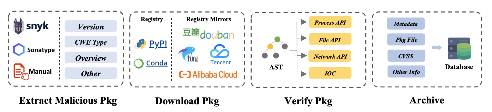

# PyPI Malicious Package Collection Pipeline Project

## Project Overview

This project aims to automate the collection of malicious packages from the PyPI platform. It extracts essential information about malicious packages from open-source databases like OSV and Snyk, then uses the package name and version information to download the source code of these malicious packages from mirrors such as Tencent, Huawei, and Tsinghua, and adds them to our database for further analysis and research.

## Pipeline

## Main Features

- **Data Collection**: Automatically gather information about PyPI malicious packages from OSV and Snyk databases, including package name, version, vulnerability description, etc.
- **Malicious Package Downloading**: Use the collected information to download the source code of malicious packages from various mirror sources.
- **Data Storage**: Store the downloaded malicious packages and their related information in a local database for subsequent analysis and research.

## Usage Instructions

1. **Environment Setup**: Ensure the Python environment is installed and the required dependencies are in place.
3. **Run the Collection Program**: Execute the main program to start automatically collecting data from OSV and Snyk databases and downloading the malicious package source code.

## Precautions

- Ensure that this project is run in a secure environment to avoid potential risks associated with malicious packages.
- Regularly update the collection scripts to adapt to changes in the OSV and Snyk databases.

## Contact Information

Thank you for your interest and support in our project!
